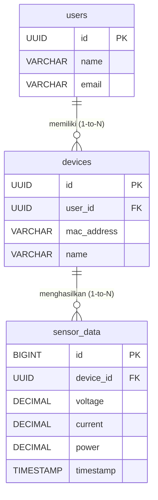

# VoltEdge IoT Energy Dashboard - Database Design

Sistem ini membutuhkan arsitektur database relasional (seperti PostgreSQL atau MySQL) untuk menyimpan data user, konfigurasi perangkat ESP32, dan pencatatan metrik sensor kelistrikan secara *time-series*.

Berikut adalah rancangan skema databasenya:

---

## 1. Tabel `users`
Menyimpan data kredensial dan profil pengguna aplikasi.

| Kolom | Tipe Data | Keterangan |
| :--- | :--- | :--- |
| `id` | `UUID` / `INT` | Primary Key |
| `name` | `VARCHAR(100)` | Nama lengkap pengguna |
| `email` | `VARCHAR(150)` | Email pengguna (UNIQUE) untuk login |
| `password_hash` | `VARCHAR(255)` | Password yang sudah dienkripsi (bcrypt/argon2) |
| `created_at` | `TIMESTAMP` | Waktu akun dibuat |
| `updated_at` | `TIMESTAMP` | Waktu akun terakhir diubah |

---

## 2. Tabel `devices` (Perangkat ESP32)
Menyimpan daftar node ESP32 yang telah di-*pairing* dan didaftarkan oleh pengguna. 
Relasi: **1 User memiliki Banyak Devices (1-to-N)**.

| Kolom | Tipe Data | Keterangan |
| :--- | :--- | :--- |
| `id` | `UUID` / `INT` | Primary Key |
| `user_id` | `UUID` / `INT` | Foreign Key (Merujuk ke `users.id`) |
| `mac_address` | `VARCHAR(17)` | MAC Address ESP32 (UNIQUE) sebagai identitas hardware |
| `name` | `VARCHAR(100)` | Nama perangkat (Contoh: "Panel Utama") |
| `location` | `VARCHAR(150)` | Lokasi perangkat (Contoh: "Ruang Server Lantai 1") |
| `status` | `ENUM('online', 'offline')`| Status koneksi terakhir perangkat |
| `max_current_limit` | `DECIMAL(10,2)` | Batas maksimal arus (A) untuk trigger *cut-off* relay |
| `price_per_kwh` | `DECIMAL(10,2)` | Harga dasar per kWh untuk menghitung estimasi tagihan |
| `created_at` | `TIMESTAMP` | Waktu perangkat didaftarkan |
| `updated_at` | `TIMESTAMP` | Waktu konfigurasi terakhir diubah |

---

## 3. Tabel `sensor_data` (Log Data Telemetri PZEM-004T)
Menyimpan data historis pembacaan kelistrikan yang dikirimkan oleh ESP32 secara *real-time*. Tabel ini akan menjadi tabel paling besar (Time-Series Data).
Relasi: **1 Device memiliki Banyak Sensor Data (1-to-N)**.

| Kolom | Tipe Data | Keterangan |
| :--- | :--- | :--- |
| `id` | `BIGINT` | Primary Key (Auto Increment) |
| `device_id` | `UUID` / `INT` | Foreign Key (Merujuk ke `devices.id`) |
| `voltage` | `DECIMAL(10,2)` | Tegangan (Volt) |
| `current` | `DECIMAL(10,3)` | Arus Listrik (Ampere) |
| `power` | `DECIMAL(10,2)` | Daya Aktif (Watt) |
| `energy` | `DECIMAL(14,4)` | Total Konsumsi Energi terakumulasi (kWh) |
| `frequency` | `DECIMAL(5,2)` | Frekuensi Listrik (Hz) |
| `power_factor`| `DECIMAL(3,2)` | Faktor Daya (PF / Cos Phi) |
| `timestamp` | `TIMESTAMP` | Waktu persis data direkam (Harus di-index untuk performa query grafik historis) |

---

## Visualisasi Relasi Database (ERD)

Berikut adalah diagram relasi antar entitas (*Entity Relationship Diagram*) untuk mempermudah pemahaman:

**Penjelasan Konsep Relasinya:**

1. **`users` (1) ── (N) `devices`** 
   * **One-to-Many**: Satu pengguna (*User*) bisa memiliki dan memantau **banyak** alat kelistrikan ESP32 sekaligus (misal: satu untuk panel rumah, satu untuk bengkel, dll). 
   * Hubungannya dijembatani oleh kolom `user_id` pada tabel `devices` yang menunjuk ke pemiliknya di tabel `users`.

2. **`devices` (1) ── (N) `sensor_data`**
   * **One-to-Many**: Satu alat ESP32 akan menghasilkan **sangat banyak** baris log data kelistrikan seiring berjalannya waktu (data dikirim berulang kali).
   * Hubungannya dijembatani oleh kolom `device_id` pada tabel `sensor_data` yang merujuk ke alat ESP32 mana yang mengirimkan data tersebut.

## Catatan Optimasi (Best Practices)
1. **Time-Series Optimization**: Karena tabel `sensor_data` akan bertambah sangat cepat (misalnya data dikirim setiap 5 detik), sangat disarankan untuk menambahkan indeks (Index) pada kolom `(device_id, timestamp)`. Jika menggunakan PostgreSQL, ekstensi **TimescaleDB** sangat cocok untuk tabel `sensor_data` ini.
2. **Soft Delete**: Pertimbangkan menambahkan kolom `deleted_at` pada tabel `devices` jika sewaktu-waktu pengguna menghapus panel, agar data histori kelistrikannya tidak ikut terhapus permanen dari sistem.
