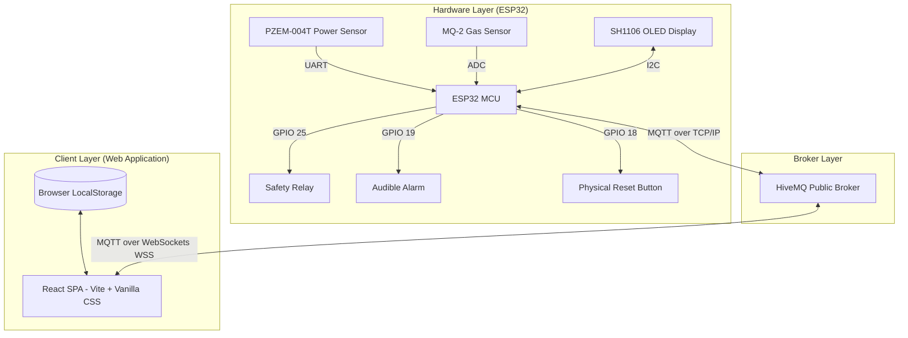
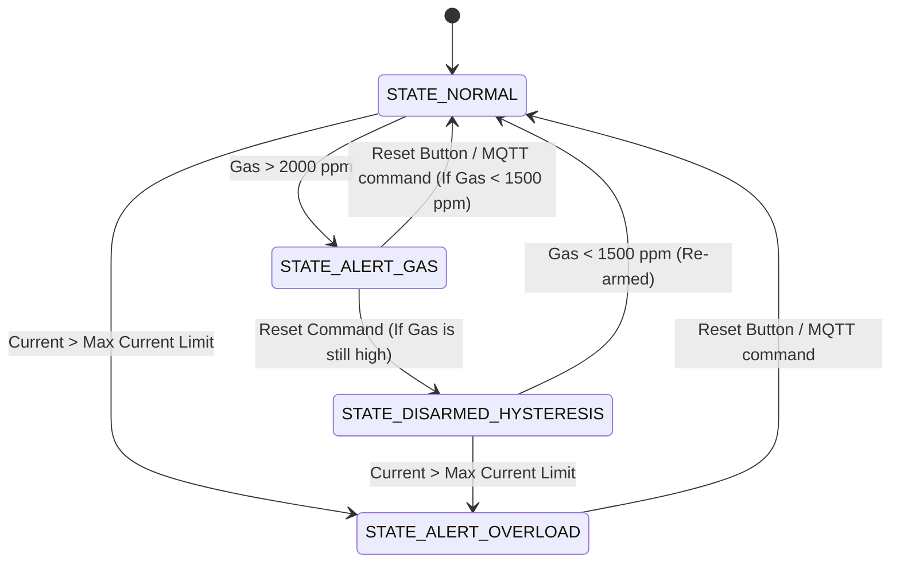

#  VoltEdge: Autonomous IoT Electricity Monitoring & Smart Protection System

Welcome, Engineer! **VoltEdge** is a premium, real-time IoT solution designed to monitor electrical parameters, detect hazardous gas leaks, and provide autonomous circuit protection. By leveraging an **ESP32 running FreeRTOS** and a **pure client-side React frontend** communicating directly via **MQTT over WebSockets**, VoltEdge eliminates the need for a traditional backend database server, minimizing latency and maximizing security.

---

## System Architecture

VoltEdge utilizes a **No-Backend, direct-broker MQTT architecture**. The React client subscribes directly to the hardware telemetry stream and controls limits remotely via WebSockets.



---

## Hardware Specifications & Pin Mapping

Below is the pin connection schematic for the ESP32 NodeMCU board:

| Component | ESP32 Pin | Interface | Description |
| :--- | :---: | :---: | :--- |
| **PZEM-004T (V3.0)** | `GPIO 16 (RX2)` / `GPIO 17 (TX2)` | HardwareSerial2 | Measures Voltage, Current, Power, Energy, Frequency, & PF. |
| **MQ-2 Gas Sensor** | `GPIO 33` | ADC (11dB Attenuation) | Detects combustible gas concentrations. |
| **Safety Relay** | `GPIO 25` | GPIO (Digital Output) | Shuts off mains power (`LOW` = Cutoff, `HIGH` = Connected). |
| **Active Buzzer** | `GPIO 19` | GPIO (PWM/Tone) | Emits distinct alarm sound frequencies under ALERT states. |
| **Reset Button** | `GPIO 18` | GPIO (Input Pullup) | Physical push button to disarm/reset active alarms. |
| **SH1106 OLED Display** | `GPIO 21 (SDA)` / `GPIO 22 (SCL)` | I2C Protocol | Displays real-time device metrics locally. |

---

##  Firmware Architecture (FreeRTOS & FSM)

The ESP32 firmware ([pzem_mq2_test.ino](file:///c:/Users/USER/Desktop/energy-dashboard/IoT/pzem_mq2_test.ino)) is split into two asynchronous RTOS tasks running on separate cores to isolate safety-critical logic from network operations:

1. **`TaskSensorRead` (Core 0, Priority 3 - High)**:
   * Periodically queries the sensors every 100ms.
   * Drives the Finite State Machine (FSM).
   * Directly triggers GPIO actuators (Relay and Buzzer) in response to safety limits.
   
2. **`TaskMQTT` (Core 1, Priority 1 - Low)**:
   * Handles WiFi reconnection and processes the MQTT receive/transmit buffers.
   * Publishes periodic telemetry payload and handles incoming control messages.

### Finite State Machine (FSM) States



---

##  MQTT Interface Specification

All communication topics are formatted as `voltedge/<action>/<MAC_ADDRESS>`:

### 1. Telemetry Publish Topic: `voltedge/telemetry/<MAC_ADDRESS>`
The ESP32 publishes a JSON string every 2 seconds (or instantly upon entering alert state):
```json
{
  "voltage": 229.4,
  "current": 0.09,
  "power": 7.6,
  "energy": 0.0245,
  "pf": 0.36,
  "gas": 384,
  "relay": true,
  "alert": "none"
}
```
*Note: `relay` matches `true` (Relay ON / Normal) or `false` (Relay OFF / Trip).*
*Values for `alert` can be `"none"`, `"gas"`, or `"overload"`.*

### 2. Configuration Subscription Topic: `voltedge/config/<MAC_ADDRESS>`
To update the safety current limit dynamically:
* **Payload**: Float value as string (e.g., `4.5`)

### 3. Action Command Topic: `voltedge/reset/<MAC_ADDRESS>`
To remotely clear a trip status:
* **Payload**: `"reset"`

### 4. Self-Test Simulation Topic: `voltedge/test/<MAC_ADDRESS>`
To test responsiveness and frontend alert states without using physical gas or high-load currents:
* `test_gas`: Artificially overrides gas reading to `3500 ppm`.
* `test_overload`: Artificially overrides current reading to limit `+ 2.0 A`.
* `test_normal`: Ends self-test simulation and returns to actual sensors.

---

## Web Frontend Application

The frontend is a modern React application built on **Vite** and styled using native, high-performance **Vanilla CSS**.

### Key Technologies
* **React 18**: Dynamic client-side UI rendering.
* **MQTT.js**: WebSockets client (`wss://`) connects directly to HiveMQ.
* **ApexCharts / Recharts**: Beautiful dashboard visualization showing real-time graphs and trend histories.
* **LocalStorage**: Keeps configuration parameters (macAddress, tariff price, limits) saved in-browser.

### Getting Started

#### Prerequisites
* Node.js (v18 or higher)
* npm (v9 or higher)

#### Setup & Launch Dev Server
1. Navigate to project root:
   ```bash
   cd c:\Users\USER\Desktop\energy-dashboard
   ```
2. Install dependencies:
   ```bash
   npm install
   ```
3. Run the development server:
   ```bash
   npm run dev
   ```
4. Access the portal at `http://localhost:5173` (or the port specified in terminal).

#### Build for Production
To bundle the frontend for static hosting:
```bash
npm run build
```
The compiled files will be located in the `dist/` directory, ready to be deployed on services like Netlify, Vercel, or GitHub Pages.

---

## Watchdog Timer (WDT) & Reliability Testing

To evaluate reliability under software faults, the system supports a simulated software crash trigger.

### How to Test WDT vs Non-WDT Firmware
1. Open the Serial Monitor at **115200 Baud**.
2. Type `freeze` or `f` and press Enter.
3. **Execution Behavior**:
   * **Without WDT (`pzem_nonwdt.ino`)**: The main sensor task enters an infinite loop, frozen forever. The safety relay remains stuck in its last state, and the buzzer cannot react. It requires a manual power cycle to reboot.
   * **With WDT (`pzem_wdt.ino` / `pzem_mq2_test.ino`)**: The system detects that the sensor-reading task has hung. The hardware Watchdog registers the timeout (configured to **15 seconds**) and automatically triggers a CPU software reset, restoring safe system operations autonomously.

---

 *VoltEdge: Engineered for Safety, Designed for Clarity.*
