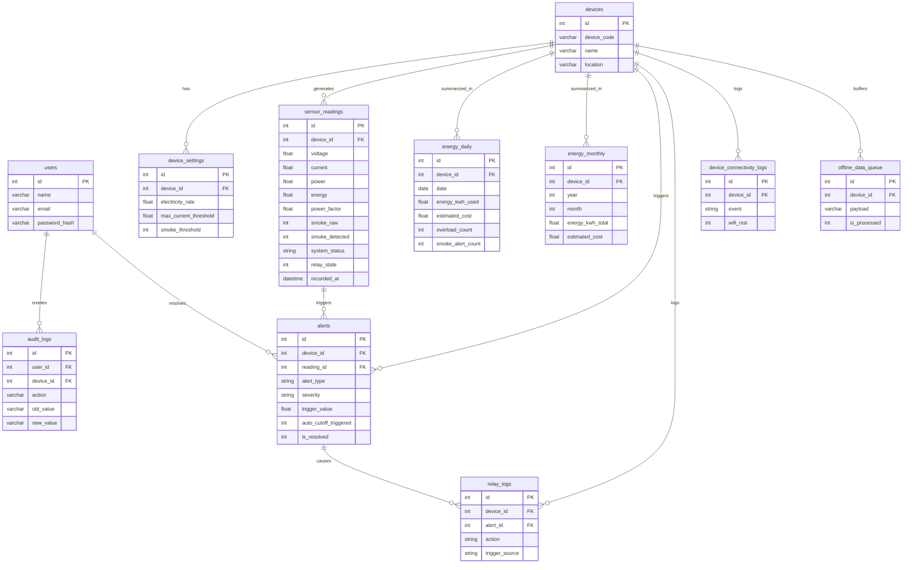

# Database Schema — IoT Electricity Monitoring & Protection System

File SQL: [schema.sql](file:///home/ezra/Desktop/iot-electricity-monitoring-and-protection/database/schema.sql)

---

## Ringkasan Tabel

| # | Tabel | Fungsi |
|---|-------|--------|
| 1 | `users` | Akun pengguna dashboard web (name, email, password) |
| 2 | `devices` | Data perangkat NodeMCU ESP32 yang terdaftar |
| 3 | `device_settings` | Konfigurasi per-perangkat: tarif listrik, batas arus, threshold asap |
| 4 | `sensor_readings` | **Core** — data mentah PZEM-004T + MQ-2 setiap ~5 detik |
| 5 | `energy_daily` | Rekap harian pemakaian kWh + estimasi biaya |
| 6 | `energy_monthly` | Rekap bulanan pemakaian kWh + estimasi biaya |
| 7 | `alerts` | Riwayat semua alarm (overload, asap, tegangan abnormal) |
| 8 | `relay_logs` | Log setiap pemutusan/pemulihan aliran listrik via relay |
| 9 | `device_connectivity_logs` | Log koneksi/diskoneksi WiFi & MQTT |
| 10 | `offline_data_queue` | Buffer data sensor saat WiFi terputus |
| 11 | `audit_logs` | Audit trail perubahan konfigurasi pengguna |

---

## Entity Relationship Diagram



---

## Views Siap Pakai

| View | Kegunaan di Dashboard |
|------|-----------------------|
| `v_latest_sensor_per_device` | Kartu status real-time (tegangan, arus, daya, status) |
| `v_daily_cost_summary` | Grafik konsumsi energi 30 hari terakhir |
| `v_monthly_cost_summary` | Grafik estimasi biaya 12 bulan terakhir |
| `v_active_alerts` | Panel notifikasi alert yang belum diselesaikan |

---

## Contoh Query Dashboard

### 1. Data Real-Time (kartu metrik utama)
```sql
SELECT * FROM v_latest_sensor_per_device
WHERE device_id = 1;
```

### 2. Estimasi Biaya Harian + Bulanan
```sql
-- Estimasi biaya hari ini
SELECT
    energy_kwh_used,
    estimated_cost AS daily_cost,
    (estimated_cost / DAY(LAST_DAY(date)) * DAY(LAST_DAY(date)))
        AS projected_monthly_cost
FROM energy_daily
WHERE device_id = 1 AND date = CURDATE();
```

### 3. Grafik Konsumsi Energi 30 Hari
```sql
SELECT * FROM v_daily_cost_summary
WHERE device_id = 1
ORDER BY date ASC;
```

### 4. Notifikasi Alert Aktif
```sql
SELECT * FROM v_active_alerts
WHERE device_id = 1;
```

### 5. Riwayat Alarm (tabel alert log di dashboard)
```sql
SELECT
    a.triggered_at,
    a.alert_type,
    a.severity,
    a.trigger_value,
    a.trigger_threshold,
    a.message,
    a.auto_cutoff_triggered,
    a.is_resolved,
    u.name AS resolved_by
FROM alerts a
LEFT JOIN users u ON u.id = a.resolved_by
WHERE a.device_id = 1
ORDER BY a.triggered_at DESC
LIMIT 50;
```

### 6. Update Tarif Listrik (input dari dashboard)
```sql
UPDATE device_settings
SET electricity_rate = 1699.53,
    updated_by = :user_id
WHERE device_id = :device_id;
```

### 7. Update Batas Arus Maksimum
```sql
UPDATE device_settings
SET max_current_threshold = 13.00,
    updated_by = :user_id
WHERE device_id = :device_id;
```

---

## Alur Data: MQTT → Database

```
ESP32 (PZEM + MQ-2)
    │
    │ MQTT publish setiap 5 detik
    ▼
MQTT Broker
    │
    ▼
Backend Server (subscriber)
    ├── INSERT → sensor_readings          (setiap 5 detik)
    ├── CHECK overload / smoke → alerts   (jika kondisi bahaya)
    ├── TRIGGER relay_logs                (jika relay trip)
    └── AGGREGATE (cron/job)
            ├── UPDATE energy_daily       (setiap malam/real-time)
            └── UPDATE energy_monthly     (setiap akhir bulan)
```

---

## Kolom Kritis `sensor_readings`

| Kolom | Tipe | Keterangan |
|-------|------|------------|
| `voltage` | DECIMAL(6,2) | Tegangan V — normal PLN 198–242V |
| `current` | DECIMAL(6,3) | Arus A — 3 desimal untuk presisi tinggi |
| `power` | DECIMAL(8,2) | Daya aktif W |
| `energy` | DECIMAL(10,4) | kWh akumulatif dari PZEM (tidak di-reset) |
| `power_factor` | DECIMAL(4,3) | 0.000–1.000 |
| `smoke_raw` | SMALLINT | ADC 0–4095 dari MQ-2 |
| `smoke_detected` | TINYINT(1) | Flag 0/1 hasil perbandingan dengan threshold |
| `system_status` | ENUM | `normal` / `overload` / `smoke` / `danger` |
| `relay_state` | TINYINT(1) | 1=ON (normal), 0=OFF (diputus) |
| `recorded_at` | DATETIME | Waktu dari RTC DS3231 (akurat) |
| `received_at` | DATETIME | Waktu server menerima (untuk deteksi offline) |

> [!TIP]
> Kolom `energy` di PZEM-004T adalah nilai **akumulatif** yang tidak di-reset. Pemakaian harian dihitung dari `energy_kwh_end - energy_kwh_start` di tabel `energy_daily`.

> [!IMPORTANT]
> Pastikan `password_hash` pada seed data **diganti** sebelum deploy ke production. Nilai default hanya placeholder.
